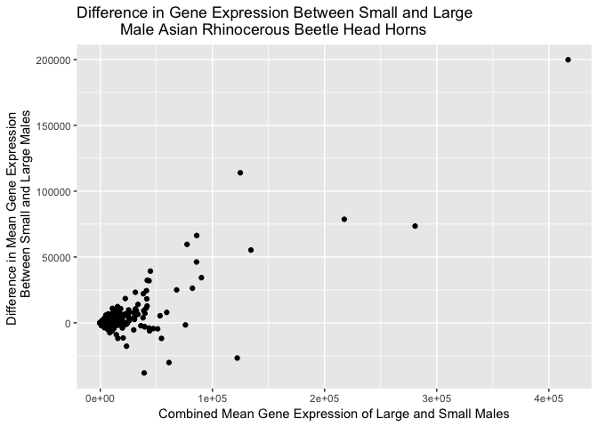
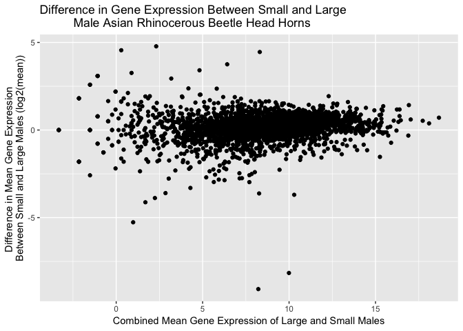
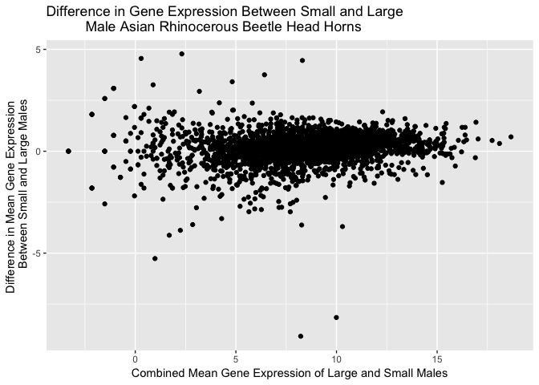

##Q2. 
**I decided to add a small value(0.1) to all of my values before calculating the log2. I chose this option because it prevents me from having to remove the missing values before calculating the log2 and should give a more accurate mean. If I were to remove all zero values then the mean would not be accounting for these zeros, and thus would be skewed to a higher mean. In this case, it is important to note that adding small values to zero creates a log2 of negative value.** 

```r
#import the data to R
rna_counts <- read.csv("~/downloads/eXpress_dm_counts.csv", header=TRUE, row.names = 1, sep = ",")

#define the mean_expression function
mean_expression <- function(x, log=TRUE) { 
        if (log==FALSE) {
           mean(x) 
         } else { 
             z<-x+0.1 
             mean(log2(z)) 
       } 
}

#test the function
mean_expression(rna_counts[[1]])
```

```
## [1] 8.934285
```

```r
mean_expression(rna_counts[[2]])
```

```
## [1] 8.943352
```

```r
mean_expression(rna_counts[[3]])
```

```
## [1] 8.119697
```

```r
mean_expression(rna_counts[[1]], log=FALSE)
```

```
## [1] 1978.847
```

```r
mean_expression(rna_counts[[2]], log=FALSE)
```

```
## [1] 1983.25
```

```r
mean_expression(rna_counts[[3]], log=FALSE)
```

```
## [1] 1583.904
```

##Q3. 

```r
#use a for loop to calculate the log transformed total_mean_expression of each sample
mean_cols <- vector(length=55)
for (i in 1:ncol(rna_counts)) {
    mean_cols[i] <- mean_expression(rna_counts[, i])
    col <- colnames(rna_counts)
    total_mean_expression_log <- cbind(col, mean_cols)
  }

head(total_mean_expression_log)
```

```
##      col                      mean_cols         
## [1,] "F101_lg_female_hdhorn"  "8.9342848802814" 
## [2,] "F101_lg_female_thxhorn" "8.94335174990747"
## [3,] "F101_lg_female_wings"   "8.1196971319383" 
## [4,] "F105_lg_female_hdhorn"  "9.03142658878025"
## [5,] "F105_lg_female_thxhorn" "8.19772753109324"
## [6,] "F105_lg_female_wings"   "8.38965975938277"
```

```r
#use a for loop to calculate the total_mean_expression of each sample
for (i in 1:ncol(rna_counts)) {
    mean_cols[i] <- mean_expression(rna_counts[, i], log=FALSE)
    col <- colnames(rna_counts)
    total_mean_expression <- cbind(col, mean_cols)
  }

head(total_mean_expression)
```

```
##      col                      mean_cols         
## [1,] "F101_lg_female_hdhorn"  "1978.84708571429"
## [2,] "F101_lg_female_thxhorn" "1983.25005714286"
## [3,] "F101_lg_female_wings"   "1583.90377142857"
## [4,] "F105_lg_female_hdhorn"  "2105.712"        
## [5,] "F105_lg_female_thxhorn" "1433.74925714286"
## [6,] "F105_lg_female_wings"   "1869.96228571429"
```

```r
#look for patterns in expression
total_mean_expression_matrix <- as.matrix(total_mean_expression)
total_mean_expression_matrix[order(total_mean_expression_matrix[mean_cols])]
```

```
##  [1] "F101_lg_female_hdhorn"  "F101_lg_female_thxhorn"
##  [3] "F101_lg_female_wings"   "F105_lg_female_hdhorn" 
##  [5] "F105_lg_female_thxhorn" "F105_lg_female_wings"  
##  [7] "F131_lg_female_hdhorn"  "F131_lg_female_thxhorn"
##  [9] "F131_lg_female_wings"   "F135_sm_female_wings"  
## [11] "F135_sm_female_hdhorn"  "F135_sm_female_thxhorn"
## [13] "F136_sm_female_hdhorn"  "F136_sm_female_thxhorn"
## [15] "F136_sm_female_wings"   "F196_sm_female_hdhorn" 
## [17] "F196_sm_female_thxhorn" "F196_sm_female_wings"  
## [19] "F197_sm_female_hdhorn"  "F197_sm_female_thxhorn"
## [21] "F197_sm_female_wings"   "F218_lg_female_hdhorn" 
## [23] "F218_lg_female_thxhorn" "F218_lg_female_wings"  
## [25] "M120_sm_male_genitalia" "M120_sm_male_hdhorn"   
## [27] "M120_sm_male_thxhorn"   "M120_sm_male_wings"    
## [29] "M125_lg_male_genitalia" "M125_lg_male_hdhorn"   
## [31] "M125_lg_male_wings"     "M160_lg_male_genitalia"
## [33] "M160_lg_male_hdhorn"    "M160_lg_male_thxhorn"  
## [35] "M160_lg_male_wings"     "M171_sm_male_genitalia"
## [37] "M171_sm_male_hdhorn"    "M171_sm_male_thxhorn"  
## [39] "M171_sm_male_wings"     "M172_sm_male_genitalia"
## [41] "M172_sm_male_hdhorn"    "M172_sm_male_thxhorn"  
## [43] "M172_sm_male_wings"     "M180_lg_male_genitalia"
## [45] "M180_lg_male_hdhorn"    "M180_lg_male_thxhorn"  
## [47] "M180_lg_male_wings"     "M200_sm_male_genitalia"
## [49] "M200_sm_male_hdhorn"    "M200_sm_male_thxhorn"  
## [51] "M200_sm_male_wings"     "M257_lg_male_genitalia"
## [53] "M257_lg_male_hdhorn"    "M257_lg_male_thxhorn"  
## [55] "M257_lg_male_wings"
```
**Males have higher expression levels than females.**

##Q4.  

```r
#use sapply to calculate the mean expression of each sample
total_mean_expression_sapply_log <- sapply(rna_counts, mean_expression)
total_mean_expression_sapply <- sapply(rna_counts, mean_expression, log=F)

head(total_mean_expression_sapply_log)
```

```
##  F101_lg_female_hdhorn F101_lg_female_thxhorn   F101_lg_female_wings 
##               8.934285               8.943352               8.119697 
##  F105_lg_female_hdhorn F105_lg_female_thxhorn   F105_lg_female_wings 
##               9.031427               8.197728               8.389660
```

```r
head(total_mean_expression_sapply)
```

```
##  F101_lg_female_hdhorn F101_lg_female_thxhorn   F101_lg_female_wings 
##               1978.847               1983.250               1583.904 
##  F105_lg_female_hdhorn F105_lg_female_thxhorn   F105_lg_female_wings 
##               2105.712               1433.749               1869.962
```


```r
#calculate which method is faster 
system.time(for (i in 1:ncol(rna_counts)) {
  mean_cols[i]<-mean_expression(rna_counts[, i])
  col<-colnames(rna_counts)
  total_mean_expression <- cbind(col, mean_cols)
   })
```

```
##    user  system elapsed 
##   0.028   0.001   0.036
```

```r
system.time(total_mean_expression_sapply<-sapply(rna_counts, mean_expression))
```

```
##    user  system elapsed 
##   0.011   0.000   0.011
```

  **The sapply method is faster.**

##Q5. 

```r
#use colMeans function to calculate mean expression of each sample
total_mean_expression_easy <- colMeans(rna_counts)
head(total_mean_expression_easy)
```

```
##  F101_lg_female_hdhorn F101_lg_female_thxhorn   F101_lg_female_wings 
##               1978.847               1983.250               1583.904 
##  F105_lg_female_hdhorn F105_lg_female_thxhorn   F105_lg_female_wings 
##               2105.712               1433.749               1869.962
```

```r
#or to get it with log2 transformed data
total_mean_expression_log_easy <- colMeans(log2(rna_counts+0.1))
head(total_mean_expression_log_easy)
```

```
##  F101_lg_female_hdhorn F101_lg_female_thxhorn   F101_lg_female_wings 
##               8.934285               8.943352               8.119697 
##  F105_lg_female_hdhorn F105_lg_female_thxhorn   F105_lg_female_wings 
##               9.031427               8.197728               8.389660
```

##Q6.

```r
#calculate the mean expression of each gene
mean_gene_expression <- rowMeans(rna_counts)
head(mean_gene_expression)
```

```
## FBpp0087248 FBpp0293785 FBpp0080383 FBpp0077879 FBpp0311746 FBpp0289081 
##    23.45455  3446.90909    79.54545   139.21818   145.09091  1485.90909
```

```r
#or to get it with log2 transformed:
mean_gene_expression_log <- rowMeans(log2(rna_counts+0.1))
head(mean_gene_expression_log)
```

```
## FBpp0087248 FBpp0293785 FBpp0080383 FBpp0077879 FBpp0311746 FBpp0289081 
##    4.328730   11.016625    6.204964    5.409514    7.084939   10.307008
```

##Q7.


```r
#calculate the mean gene expression for both large and small male head horn
combined_gene_expression <- rowMeans(rna_counts[ ,grep("M*_*_male_hdhorn", col, value=TRUE)])
head(combined_gene_expression)
```

```
## FBpp0087248 FBpp0293785 FBpp0080383 FBpp0077879 FBpp0311746 FBpp0289081 
##      29.375    5017.875      68.875      14.375     132.000    1169.250
```

```r
#calculate the mean gene expression for small male head horn
sm_gene_expression <- rowMeans(rna_counts[ ,grep("M*_sm_male_hdhorn", col, value=TRUE)])
head(sm_gene_expression)
```

```
## FBpp0087248 FBpp0293785 FBpp0080383 FBpp0077879 FBpp0311746 FBpp0289081 
##       37.50     3313.25       71.75       22.50      119.00     1179.00
```

```r
#calculate the mean gene expression for large male head horn
lg_gene_expression <- rowMeans(rna_counts[ ,grep("M*_lg_male_hdhorn", col, value=TRUE)])
head(lg_gene_expression)
```

```
## FBpp0087248 FBpp0293785 FBpp0080383 FBpp0077879 FBpp0311746 FBpp0289081 
##       21.25     6722.50       66.00        6.25      145.00     1159.50
```

```r
#calculate the difference in mean gene expression between large and small male head horn
difference_mean_expression <- lg_gene_expression - sm_gene_expression
head(difference_mean_expression)
```

```
## FBpp0087248 FBpp0293785 FBpp0080383 FBpp0077879 FBpp0311746 FBpp0289081 
##      -16.25     3409.25       -5.75      -16.25       26.00      -19.50
```

##Q8.


```r
#calculate the log transformed mean gene expression for large and small male head horn
combined_gene_expression_log <- log2(rowMeans(rna_counts[ ,grep("M*_*_male_hdhorn", col, value=TRUE)] + 0.1))

#calculate the log transformed mean gene expression for small male head horn
sm_gene_expression_log <- log2(rowMeans(rna_counts[ ,grep("M*_sm_male_hdhorn", col, value=TRUE)] + 0.1))

#calculate the log transformed mean gene expression for large male head horn
lg_gene_expression_log <- log2(rowMeans(rna_counts[ ,grep("M*_lg_male_hdhorn", col, value=TRUE)] + 0.1))

#calculate the log transformed mean gene expression difference between large and small male head horn
difference_mean_expression_log <- lg_gene_expression_log - sm_gene_expression_log

#graph the MAplot
library(ggplot2)
ggplot(rna_counts, aes(x=combined_gene_expression, y=difference_mean_expression))+
    geom_point()+
  ggtitle("Difference in Gene Expression Between Small and Large
          Male Asian Rhinocerous Beetle Head Horns")+
  labs(x="Combined Mean Gene Expression of Large and Small Males", y="Difference in Mean Gene Expression 
       Between Small and Large Males")
```

<!-- -->

```r
#graph the MAplot using log transformed data
ggplot(rna_counts, aes(x=combined_gene_expression_log, y=difference_mean_expression_log))+
    geom_point()+
  ggtitle("Difference in Gene Expression Between Small and Large
          Male Asian Rhinocerous Beetle Head Horns") +
  labs(x="Combined Mean Gene Expression of Large and Small Males", y="Difference in Mean Gene Expression 
       Between Small and Large Males (log2(mean))")
```

<!-- -->

##Bonus.

```r
library(dplyr)
```

```
## 
## Attaching package: 'dplyr'
```

```
## The following objects are masked from 'package:stats':
## 
##     filter, lag
```

```
## The following objects are masked from 'package:base':
## 
##     intersect, setdiff, setequal, union
```

```r
#Using the tidyverse, although not necessarily easier, another way to calculate the mean gene expression of each gene in small and large males
combined_gene_expression_tidy <- rna_counts %>%
     select(colnames(rna_counts[ , grep("M*_*_male_hdhorn", col)])) %>%
     rowMeans()
sm_gene_expression_tidy <- rna_counts %>%
     select(colnames(rna_counts[ , grep("M*_sm_male_hdhorn", col)])) %>%
     rowMeans()
lg_gene_expression_tidy <- rna_counts %>%
     select(colnames(rna_counts[ , grep("M*_lg_male_hdhorn", col)])) %>%
     rowMeans()
difference_mean_expression_tidy <- lg_gene_expression_tidy - sm_gene_expression_tidy

#graph the result
ggplot(rna_counts, aes(x=combined_gene_expression_tidy, y=difference_mean_expression_tidy))+
    geom_point()+
  ggtitle("Difference in Gene Expression Between Small and Large
          Male Asian Rhinocerous Beetle Head Horns")+
  labs(x="Combined Mean Gene Expression of Large and Small Males", y="Difference in Mean Gene Expression 
       Between Small and Large Males")
```

<!-- -->

```r
#for log transformed mean gene expression
combined_gene_expression_tidy_add <- rna_counts %>%
     select(colnames(rna_counts[ , grep("M*_*_male_hdhorn", col)])) + 0.1

combined_gene_expression_tidy_log <- log2(rowMeans(combined_gene_expression_tidy_add))

sm_gene_expression_tidy_add <- rna_counts %>%
     select(colnames(rna_counts[ , grep("M*_sm_male_hdhorn", col)])) + 0.1
     
sm_gene_expression_tidy_log <- log2(rowMeans(sm_gene_expression_tidy_add))

lg_gene_expression_tidy_add <- rna_counts %>%
     select(colnames(rna_counts[ , grep("M*_lg_male_hdhorn", col)])) + 0.1
     
lg_gene_expression_tidy_log <- log2(rowMeans(lg_gene_expression_tidy_add))

difference_mean_expression_tidy_log <- lg_gene_expression_tidy_log - sm_gene_expression_tidy_log

#graph the result
ggplot(rna_counts, aes(x=combined_gene_expression_tidy_log, y=difference_mean_expression_tidy_log))+
    geom_point()+
  ggtitle("Difference in Gene Expression Between Small and Large
          Male Asian Rhinocerous Beetle Head Horns")+
  labs(x="Combined Mean Gene Expression of Large and Small Males", y="Difference in Mean Gene Expression 
       Between Small and Large Males")
```

<!-- -->


